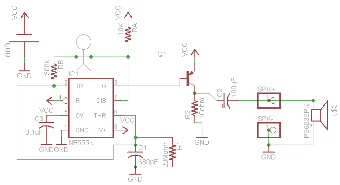

# Drawdio Resouces
## Circuit files

- [Board schematic](./drawdio2.sch)
- [Board layout](./drawdio2.brd)

All of the files come from the wonderful [LadyAda
site](https://learn.adafruit.com/drawdio/download)

## Teaching resources
- [Learning to solder](./SolderComic.pdf)
